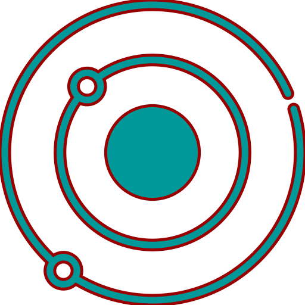

<br/>
<p align="center">
  <a href="https://github.com/SlowWave/SOMEnvs">
    
  </a>

  <h3 align="center">SOMEnvs</h3>

  <p align="center">
    Spacecraft Orbital Mechanics Environments
    <br/>
    <br/>
  </p>
</p>

## Table Of Contents

* [About the Project](#about-the-project)
* [Built With](#built-with)
* [Getting Started](#getting-started)
  * [Prerequisites](#prerequisites)
  * [Installation](#installation)
* [Usage](#usage)
* [License](#license)

## About The Project

This repository serves as a collection of Gymnasium environments specifically designed to facilitate the training of reinforcement learning agents in spacecraft missions scenarios. These environments are powered by the Basilisk framework, a versatile tool used for high-fidelity and computationally efficient simulations of spacecraft missions.

The provided environments are designed to facilitate research and experimentation in the field of reinforcement learning applied to space missions. By offering a standardized interface compatible with Gymnasium, researchers and practitioners can seamlessly integrate these environments into their reinforcement learning pipelines, enabling the development and evaluation of novel algorithms and strategies for space mission optimization.

In addition to the simulation environments, this repository also contains scripts designed to train and validate reinforcement learning agents using Stable-Baselines3. 

> At present, the repository hosts only one developed environment, however, the overarching aim is to expand this collection by introducing additional environments simulating diverse spacecraft mission scenarios.

## Built With

This project relies on the following key dependencies:

* [Basilisk](https://hanspeterschaub.info/basilisk/index.html): Basilisk is utilized for high-fidelity modeling and simulation of spacecraft mission scenarios.

* [Gymnasium](https://gymnasium.farama.org/): Gymnasium provides the framework for creating and managing simulation environments, allowing for standardized interfaces for reinforcement learning experiments.

* [Stable-Baselines3](https://stable-baselines3.readthedocs.io/en/master/): Stable-Baselines3 offers a collection of reinforcement learning algorithms and utilities, facilitating the training and evaluation of reinforcement learning agents within the Gymnasium environments.


## Getting Started

### Prerequisites

Before using the environments in this repository, ensure that you have installed the Basilisk framework. 

You can find detailed instructions for installing Basilisk on the official website. Please refer to the installation documentation available there to set up Basilisk on your system:

[Install Basilisk](https://hanspeterschaub.info/basilisk/Install.html)

Once Basilisk is successfully installed, you'll be ready to utilize the environments in this repository.

### Installation

1. Clone SOMEnvs repository

```sh
$ git clone git@github.com:SlowWave/SOMEnvs.git
```

2. Install the libraries listed in _requirements.txt_ inside the same virtual environment used to install Basilisk

```sh
(venv) $ python -m pip install -r requirements.txt
```

## Usage


## License

Distributed under the MIT License. See [LICENSE](LICENSE) for more information.

